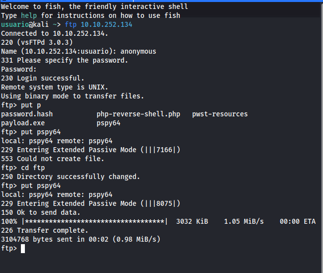

# 1. Bienvenido a Spice Hut!

Somos Spice Hut, ¡una startup que acaba de triunfar! Ofrecemos una variedad de especias y sándwiches (por si te entra hambre), pero no es por eso que estás aquí. Siendo sinceros, no estamos seguros de que nuestros desarrolladores sepan lo que hacen y nuestra preocupación por la seguridad va en aumento. Te pedimos que realices una prueba de penetración exhaustiva e intentes obtener acceso root. ¡Mucha suerte!

Comenzamos con un escaneo básico con nmap, para conocer los puertos abiertos y los servicios. Usamos:

```
nmap -sV -T5 10.10.252.134
```

Y vemos que hay 3 puertos abiertos, el 21, el 22 y el 80.


Como tenemos un servicio FTP en el puerto 21, comprobaremos en primer lugar si podemos acceder a el de forma anónima. 

```
ftp 10.10.252.134
```

Y hemos podido conectar sin problemas.


Una vez conectados, echaremos un vistazo al contenido, vemos que hay un directorio llamado "ftp" el cual, según sus permisos, nos debe permitir subir archivos a él. También vemos dos archivos, uno llamado notice.txt y el otro es una imagen llamada important.jpg. Los descargamos para ver su contenido.


El archivo notice.txt, no parece tener nada especial, solo es alguien quejándose de que suben memes de among us a la pagina web. Habla de una tal "Maya" no se si ese nombre será relevante mas adelante.


La imagen important.jpg es un meme de among us, no tiene nada de especial, tan solo dice "Todo el mundo se pregunta quien es el impostor, pero nadie se pregunta porque lo es", No sé si tendrá algo oculto con steganografía, de momento no lo voy a investigar, si más adelante no encuentro nada más la analizaré mas detenidamente.


Una vez visto el servicio FTP, como para SSH no tenemos credenciales, ni forma de averiguarlas, echaremos un vistazo a la web, ya que vimos en el escaneo de nmap que había un servicio web en el puerto 80.

En la página principal, vemos un mensaje del equipo de desarrollo en el que dicen que buscan un desarrollador, y que si lo somos contactemos con ellos a través de un enlace que nos facilitan, el cual nos lleva a mandar un correo electrónico. En el código fuente de la página tampoco hay nada interesante.


Probaremos ahora a listar los directorios de la web, usaremos GoBuster para ello.

```
gobuster dir -u http://10.10.252.134 -w /usr/share/dirb/wordlists/common.txt
```

Podemos ver que hay un directorio llamado /files que puede ser interesante.


Accedemos a este directorio con nuestro navegador web.


Vemos que nos muestra el contenido que hay en el FTP, por lo que, en teoría si subimos un archivo al directorio FTP, podremos ejecutarlo desde el navegador y podría servirnos para conseguir una shell reversa. Probaremos a subir el archivo php para shell reversa de [Pentest Monkey](https://github.com/pentestmonkey/php-reverse-shell) que tan buen resultado nos ha dado en otras ocasiones.


Lo descargamos (Otra vez, si no lo tenéis descargado ya) y lo configuramos con nuestra Ip y el puerto como hemos hecho otras veces.


Y lo subimos al directorio "ftp" dentro del servicio FTP.


Ahora, antes de ejecutar la shell reversa, iniciaremos un listener con netcat para poder recibir la shell. Usamos:

```
nc -lvnp 1234
```


Y, ahora sí, ejecutamos la shell reversa en el navegador.


Y obtenemos la shell reversa.


Haremos que esta shell, que no es estable, lo sea algo más, además de ser interactiva.

```
bash -i
```


Ahora que ya hemos accedido a la máquina, echaremos un vistazo al contenido.


En el mismo directorio en el que estábamos, hemos encontrado un archivo llamado recipe.txt, el cual al abrirlo nos da el resultado a la primera pregunta. 

## a) ¿Cuál es la receta secreta de la sopa picante?

Como hemos visto en el archivo recipe.txt, el ingrediente secreto es el amor.

**Respuesta: Love**

## b) ¿Cuáles son los contenidos de user.txt?

Seguimos analizando los directorios y archivos, si accedemos al directorio /home, vemos que hay un usuario llamado lennie, pero no podemos acceder al directorio, supongo que solo podrá acceder el propio usuario y no tenemos permisos. Hay otro directorio llamado /incidents en el que encontramos un archivo llamado suspicious.pcapng. Lo que parece ser una captura pcap de paquetes de tráfico de red.


Como no podemos descargarlo desde la terminal, lo copiaré al directorio ftp y podremos acceder a él.

```
cp suspicious.pcapng /var/www/html/files/ftp
```


Lo abriré con Wireshark para echarle un vistazo. Seleccionaremos uno de los paquetes TCP y le daremos a seguir, para ver los detalles. Esto lo haremos con todos los paquetes TCP en busca de algo interesante.


Finalmente, tras un rato buscando, hemos encontrado esta comunicación que parece tener contenido interesante.


Le damos a seguir, y esto es lo que encontramos.


Parece ser un intento de acceso a la máquina realizado por alguien anteriormente a nosotros, usando el mismo método que hemos usado.

Vemos que ha intentado conseguir permisos root del mismo modo que hicimos nosotros en otras máquinas anteriores, y, ha intentado acceder al igual que nosotros al directorio del usuario lennie.


Vemos que ha intentado obtener acceso repetidas veces usando la contraseña "c4ntg3t3n0ughsp1c3"


Y ya no he encontrado nada más que pueda parecer relevante. Así que voy a intentar usar esa contraseña para acceder por SSH, ya que para conseguir permisos de root no sirve, como hemos visto en el archivo pcap.

Y, sí, hemos obtenido acceso por SSH usando esa contraseña.


Ahora, somos el usuario lennie, y listando sus archivos encontramos el fichero user.txt, el cual contiene la primera flag.


**Respuesta: THM{03ce3d619b80ccbfb3b7fc81e46c0e79}**

## c) ¿Cuáles son los contenidos de root.txt?

Ahora, tendremos que escalar privilegios para poder encontrar y abrir el archivo root.txt y ver la segunda flag.

Hemos listado todos los directorios y archivos de lennie, primero hemos accedido al directorio Documents y hemos encontrado varios archivos de texto, pero ninguno contiene nada interesante.


Hay otro directorio llamado "scripts" en el cual vemos un archivo de texto sin contenido y un script bash llamado planner.sh


Al consultar el contenido del archivo planner.sh, vemos que este archivo ejecuta print.sh y si consultamos ese archivo, tenemos permisos sobre el.


Así que podemos averiguar si este archivo se ejecuta de manera automática, y de ser así, podríamos modificarlo para convertirlo en un payload que ejecute una shell reversa que nos de acceso como root.

Para averiguar esto, hemos usado una herramienta llamada "[pspy](https://github.com/DominicBreuker/pspy/releases/download/v1.2.1/pspy64)" que nos servirá para comprobar si se está ejecutando el proceso planner.sh por el usuario root, lo cual nos permitirá hacer lo que hemos dicho antes del payload.

Lo descargamos y lo subimos al directorio ftp dentro del servicio FTP.



Y lo ejecutamos.


Vemos, que efectivamente, se ejecuta planner.sh, y además, vemos que se ejecuta cada minuto.


Por lo que, podemos intentar hacer lo que dijimos de inyectar un payload con el archivo print.sh

Así que consultamos las cheat sheets de [Pentest monkey](), para ver el comando que debemos insertar en el archivo print.sh.


Evidentemente lo modificaremos con nuestra Ip y puerto.

```
nano /etc/print.sh
```


Ahora, como hacemos siempre iniciaremos un listener con netcat.

```
nc -lvnp 1234
```

y esperaremos a que se ejecute planner.sh para que nos de la shell reversa.


Ya tenemos la shell, y como vemos, somos usuario root.


Ahora, buscaremos el archivo root.txt (misma ruta de siempre de THM), y encontraremos la flag.


**Respuesta: THM{f963aaa6a430f210222158ae15c3d76d}**