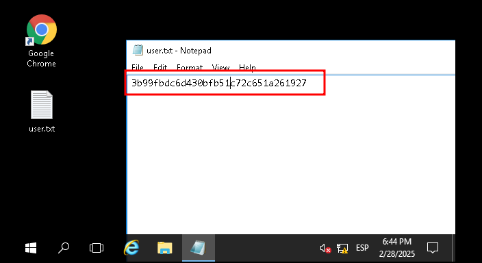

# 1) Objetivo

En esta maquina se nos pide que encontremos un directorio oculto y el contenido de los archivos user.txt y root.txt. Se nos indica que esta maquina no responde a ping (ICMP).

# 2) Reconocimiento y obtener acceso

Lo primero que hacemos como siempre es hacer un escaneo de puertos con nmap, en este caso, en nuestro comando, usaremos -Pn (como hicimos en la maquina Blaster cuando nos dio el error de ping) ya que nos han avisado en el enunciado que la maquina no responde a ICMP. Así que ejecutaremos el comando:

```
nmap -sV -T4 -Pn 10.10.154.77
```


Vemos que hay dos puertos abiertos, el 80 y el 3389.

En el puerto 80 tenemos un servidor web, así que accedemos a la web para echar un vistazo.


No hay pagina web, solo la pagina por defecto de IIS web server. Así que vamos a analizar la web con gobuster para listar los directorios. (En la pista que nos dan nos recomiendan usar el listado "dirbuster 2.3 medium"). Nuestro comando quedaría así:

```
gobuster dir -u http://10.10.154.77/ -w /usr/share/wordlists/dirbuster/directory-list-2.3-medium.txt -t 500
```

He probado con -t 500 para que fuera mas rapido, pero me da un monton de errores, así que lo dejaremos así:

```
gobuster dir -u http://10.10.154.77/ -w /usr/share/wordlists/dirbuster/directory-list-2.3-medium.txt
```


Encontramos el direcrtorio oculto "/retro", ya podemos contestar a la pregunta que se nos hace:

Hay un servidor web ejecutándose en el destino. ¿Cuál es el directorio oculto en el que se encuentra el sitio web?

**Respuesta: /retro**

Accedemos al directorio /retro para echarle un vistazo.


Y vemos que es la misma pagina web que teníamos en la maquina "Blaster".

Así que al igual que en esa maquina, ya tenemos al usuario, Wade.


Evidentemente, no será todo igual que en la maquina Blaster, así que investigaremos por la página web en busca de pistas.

De momento, buscando el archivo robots.txt, vemos que no existe.


Si tenemos, al igual que en la máquina "blaster", la pista de la contraseña, "parzival" dentro del comentario al post "Ready player one".


Por lo que ya tenemos nombre de usuario y contraseña, como tenemos ademas del servidor web un acceso para escritorio remoto, hacemos igual que con "blaster", usamos remmina para acceder con las credenciales conseguidas.


Y conseguimos conectarnos.


En el escritorio, encontramos el archivo user.txt, lo abrimos y encontramos el código de respuesta:



**user.txt: 3b99fbdc6d430bfb51c72c651a261927**

Seguimos investigando y en la papelera de reciclaje, encontramos la misma aplicación que en la maquina blaster, con la que conseguimos obtener la shell inversa. 


En Google chrome, vemos que el usuario ha buscado información sobre la vulnerabilidad CVE-2019-1388. 


Si buscamos como explotar esta vulnerabilidad, encontraremos que es exactamente lo mismo que hicimos en la maquina "blaster".


Así que como tenemos todo lo que necesitamos, sacaremos la aplicación de la papelera de reciclaje, nos aparecerá en el escritorio.


y procedemos igual que ya hicimos la otra vez, ejecutamos la aplicación, clicamos en "show more details".


después en "Ver informacion del certificado" (Show information about the publisher's certificate).


clicamos en el certificado.


Y aquí se supone que deberían aparecernos los navegadores instalados, para seleccionar uno, pero no aparecen.


si intentamos cerrar la aplicación y volverla a abrir, obtenemos el mismo resultado, así que probamos a reiniciar la maquina por si es un fallo de esta. Nada, siguen sin aparecer, intento poner como explorador por defecto Internet explorer.


Y nada, mas de lo mismo, se ve que en esta maquina no funciona bien este sistema, quizás por eso estaba en la papelera la aplicación.

Buscamos otro exploit que pueda servirnos, en internet nos sugieren que explotemos la vulnerabilidad CVE-2017-0213, dicho cve se puede encontrar haciendo una busqueda en internet por la version concreta de sistema operativo que está corriendo la maquina y su build concreta, esto lo podemos ver ejecutando:

```
systeminfo
```


Nos indican una web https://github.com/WindowsExploits/Exploits/tree/master/CVE-2017-0213 en la que podemos descargar un ejecutable para realizar la explotación.

Una vez descargado el archivo y haberlo descomprimido, en nuestra maquina atacante, iniciaremos un servidor web con python, para poder pasar el archivo a la maquina objetivo.
Abrimos una terminal en el mismo lugar donde tenemos el archivo que hemos descargado e iniciamos el servidor ejecutando:

```
python3 -m http.server
```


Y en la maquina victima, abrimos chrome y accedemos a la ip de nuestro servidor que acabamos de crear, una vez ahi, descargamos el exploit.


Nos advertirá de que es un archivo sospechoso, aceptamos


y lo ejecutamos.


Una vez ejecutado, en el terminal que se nos abre, si ejecutamos:

```
whoami
```

Veremos que ya tenemos privilegios de root.


Ahora, buscaremos el archivo root.txt. (como ya sabemos la ruta en la que estaba en la maquina blaster, miramos primero en esa ruta). Encontraremos el archivo.


Lo abriremos usando:

```
type root.txt.txt
```

y veremos el código de respuesta.


**root.txt: 7958b569565d7bd88d10c6f22d1c4063**